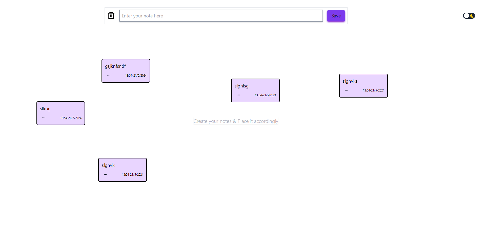
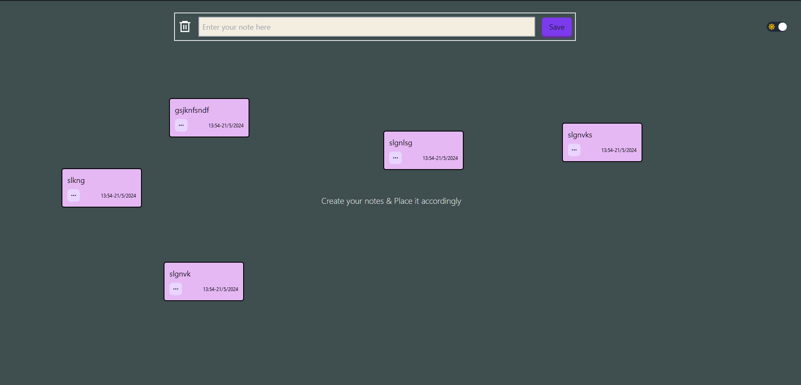
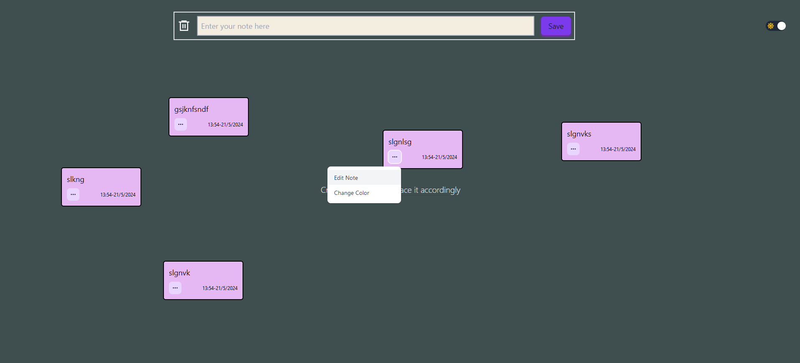
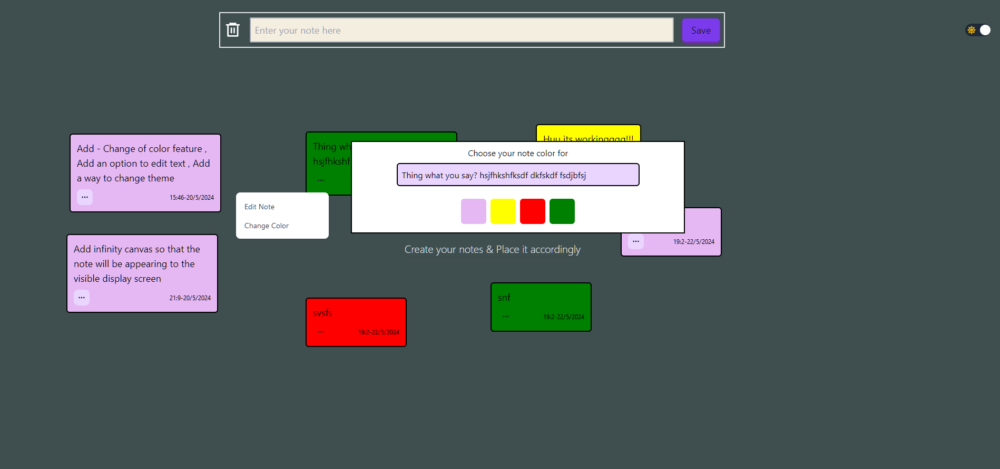
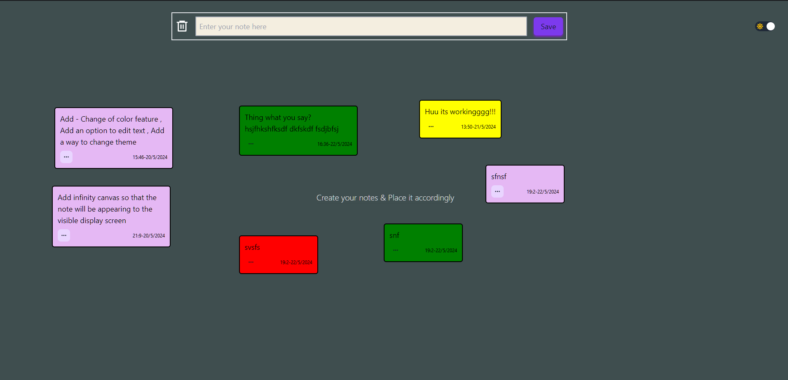
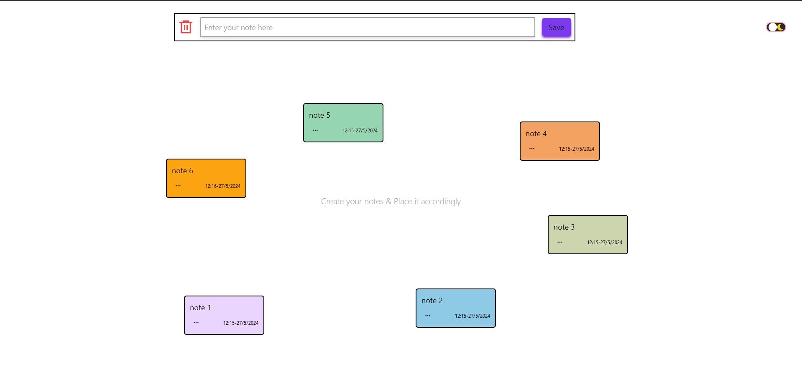
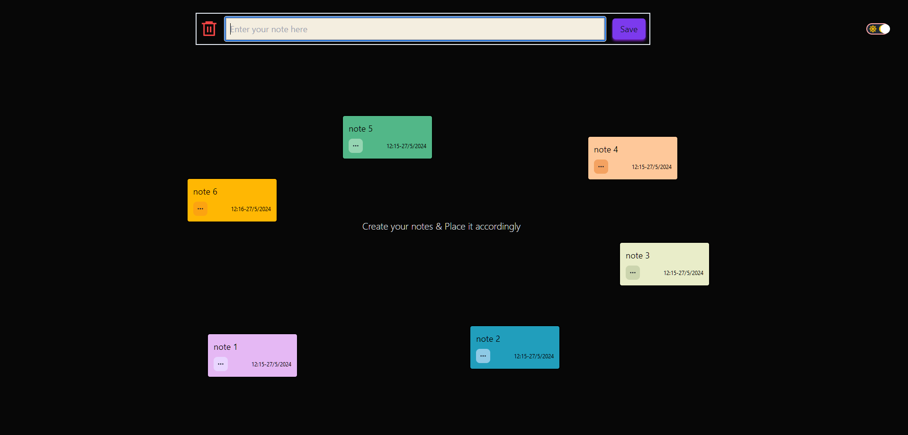

# Sticky Notes
---
How to setup Sticky Notes??

`git clone https://github.com/MrPurushotam/sticky-notes.git`

`cd ./sticky-notes`

`npm i`

`npm run dev`

<!-- 

Now user can update there note color as well.
---

 -->

